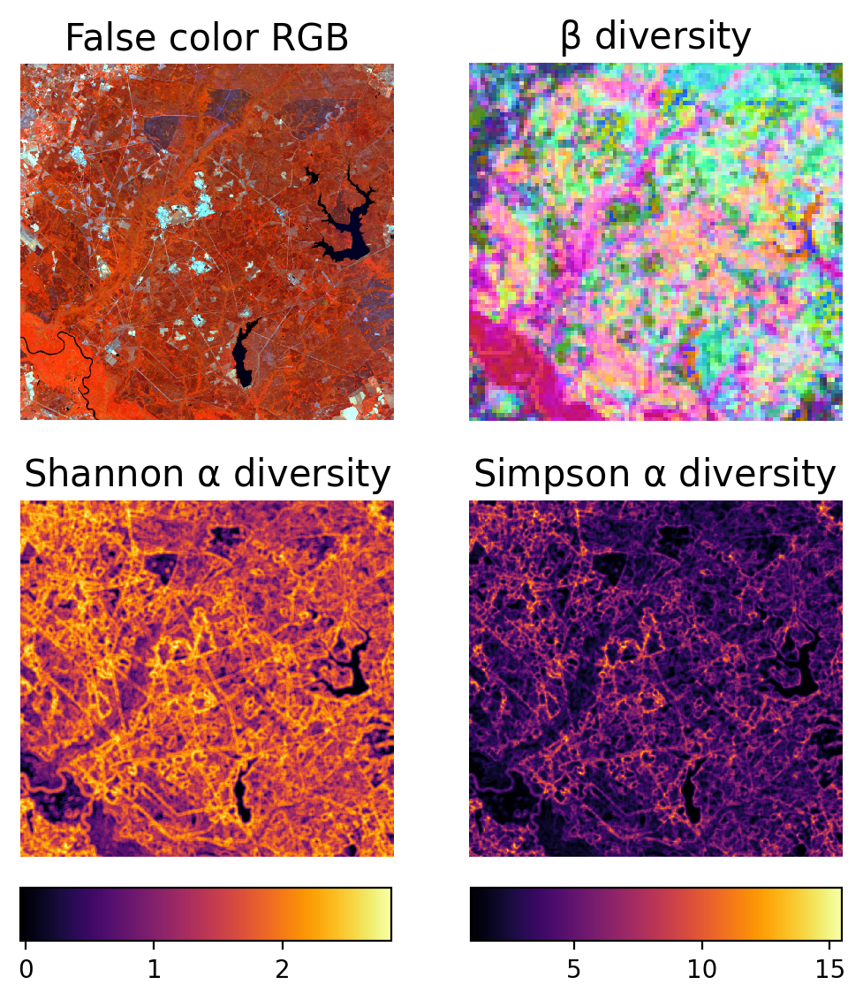

# sister-biodiversity

This repository contains code for calculating alpha and beta spectral diversity metrics. Methods were
adapted from Féret & de Boissieu (2020) but do not exactly replicate their techniques. We have included a
command line script, which can automatically generate diversity metrics with user specfied parameters,
along with an interactive Jupyter notebook (*recommended*).


Féret, J. B., & de Boissieu, F. (2020).
biodivMapR: An r package for α‐and β‐diversity mapping
using remotely sensed images.
Methods in Ecology and Evolution, 11(1), 64-70.
https://doi.org/10.1111/2041-210X.13310





## Installation

```bash
pip -r requirements.txt
```

## Use

```bash
python spectral_diversity.py reflectance_image output_directory
```

Optional arguments:

- `--nclusters`: Number of k-means clusters, default = 25
- `--window`: Window size for calculating diversity metrics, default= 10
- `--pca`: Export PCA image, default = False
- `--species`: Export spectral species map, default = False
- `--ncpus`: Number of CPUs for MDS, default = 1
- `--verbose`: default = False
